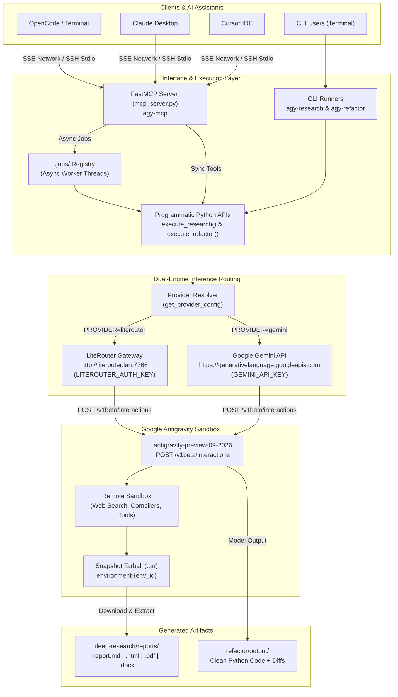
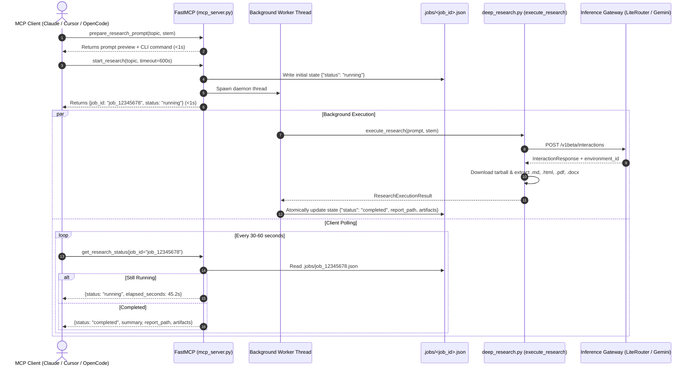

# Architectural Blueprint: `agy-agents`

`agy-agents` is an open-source framework designed for autonomous research generation and automated codebase modernization. It connects to the stateful Google Antigravity environment (`antigravity-preview-09-2026`) via the `/v1beta/interactions` endpoint.

---

## 1. System Topology & Component Overview



---

## 2. Hybrid Async MCP Execution Sequence

Standard MCP clients enforce a **hard 60-second RPC timeout**. Deep research runs take 3–8 minutes because the 5-persona council executes 50 live Google searches and compiles documents in the remote sandbox. The diagram below shows how the hybrid non-blocking job protocol operates:



---

## 3. Core Component Boundaries

| Component | Responsibility | Inputs / Outputs |
| :--- | :--- | :--- |
| `mcp_server.py` | FastMCP server implementation. Manages the 6 sovereign tools, unwraps parameter defaults, and coordinates non-blocking background workers. | **In:** MCP JSON-RPC calls.<br/>**Out:** Markdown previews, job IDs, status payloads, diffs. |
| `deep_research.py` | Modular import shim over `deep-research/deep-research.py`. Builds prompt payloads, executes council queries, and extracts sandbox artifacts. | **In:** `prompt_content`, `prompt_stem`.<br/>**Out:** `ResearchExecutionResult` with paths to `.md`, `.html`, `.pdf`, `.docx`. |
| `refactor/refactor.py` | Dual-engine refactoring engine. Handles single-file CLI requests and concurrent batch manifests. Strips code fences and checks AST syntax. | **In:** Python source string or file path.<br/>**Out:** Validated PEP-8 code and `RefactorExecutionResult`. |
| `.jobs/` | Local filesystem job registry for tracking background research tasks. | JSON files named `<job_id>.json`. |
| `deep-research/prompts/` | Prompt template library containing structured 5-persona research protocols. | Markdown files defining personas and research rubrics. |

---

## 4. Contract Schemas & Invariants (Pydantic V2)

All data moving through `agy-agents` is strictly governed by Pydantic V2 models (`pydantic>=2.10.0`):

1. **`ProviderConfig` (Immutable)**:
   - Validates gateway URLs (`http://...` or `https://...`), download URL templates, and HTTP authorization headers.
   - Frozen to guarantee thread-safe configuration sharing.
2. **`InteractionRequest` & `InteractionResponse`**:
   - Models the Google Antigravity `/v1beta/interactions` wire format.
   - Ensures `agent` is set to `antigravity-preview-09-2026` and `environment` is `remote`.
3. **`RefactorManifest`**:
   - Strictly validates batch manifests in `refactor/manifests/*.json` (`target_files`, `reference_files`, `output_mode`).
4. **`StartResearchInput` & `RefactorInput`**:
   - Enforce `min_length`, non-zero timeouts, and strict `ConfigDict(extra="forbid", validate_assignment=True)` to reject malformed parameters early.

---

## 5. Deterministic Verification Primitives

Agents working on this repository MUST verify their work using the following deterministic commands:

```bash
# 1. Unit & Integration Test Suite (covers schemas, tool registration, lifecycle)
uv run python -m unittest tests/test_mcp_server.py

# 2. Gateway Connectivity & Health Inspection
uv run python -c "import mcp_server; print(mcp_server.check_gateway_health())"

# 3. Prompt Template Scan
uv run python -c "import mcp_server; print(mcp_server.list_research_prompts())"

# 4. FastMCP Server Entrypoint Check
uv run agy-mcp --help

# 5. Network SSE Endpoint Health Probe (Intranet)
curl -s -D - -o /dev/null -m 2 http://agy-agents.lan:7788/sse
# or direct IP:
curl -s -D - -o /dev/null -m 2 http://192.168.50.10:7788/sse
```
